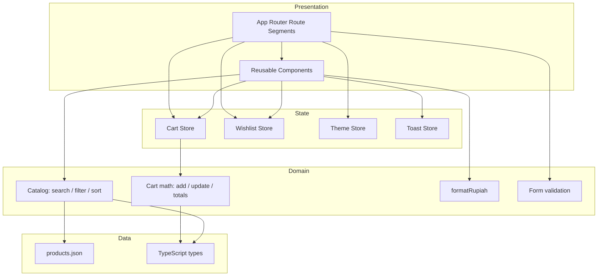
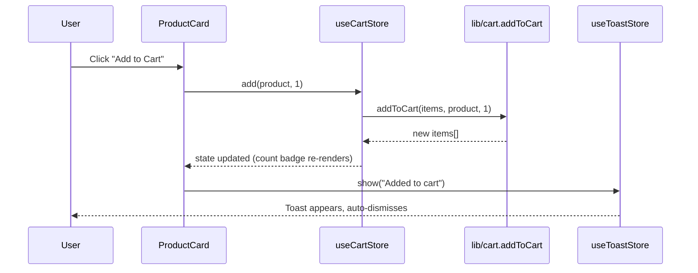

# Design Document

## Overview

ShopEase is a front-end-only e-commerce web application built with Next.js (App Router), TypeScript, Tailwind CSS, and Zustand. It demonstrates modern, responsive UI development for a portfolio context. There is no real backend, database, or payment gateway: the Product_Catalog is a static local JSON dataset, and all "persistence" is client-side state held for the duration of a browser session via Zustand stores. Authentication, checkout, and payment are simulated.

This design translates the 17 requirements into a concrete architecture: a layered separation between **pure domain logic** (catalog queries, cart math, currency formatting, validation), **state management** (Zustand stores for cart, wishlist, theme), **presentation** (reusable React components and route segments), and **data** (the local product JSON). The key design intent is to keep all business logic in pure, testable functions so the same logic can be exercised by property-based tests independently of React rendering.

### Goals

- Deliver every functional surface described in the requirements: browse, search, filter, sort, detail, cart, wishlist, dummy checkout, dummy auth, toasts, skeletons, empty states, responsive layout, dark mode.
- Keep domain logic pure and framework-agnostic so it is fully unit- and property-testable.
- Be deploy-ready for Vercel with zero server-side dependencies beyond static rendering.
- Format all currency in Indonesian Rupiah (`Rp 250.000`).

### Non-Goals

- Real authentication, server persistence, or payment processing.
- Server-side data fetching from external APIs (data is bundled locally).
- Cross-session persistence is optional and treated as enhancement, not a hard requirement (requirements scope persistence to "during a browser session").

### Technology Decisions

| Concern | Choice | Rationale |
| --- | --- | --- |
| Framework | Next.js 14+ App Router | Modern routing, file-based segments, Vercel-native, RSC + client components. |
| Language | TypeScript (strict) | Requirement 16.2 mandates TS for all source files; strict mode catches errors early. |
| Styling | Tailwind CSS | Utility-first, mobile-first responsive utilities, built-in `dark:` variant for dark mode. |
| State | Zustand | Lightweight, hook-based global store for Cart, Wishlist, Theme (Requirement 9.8, 10.6, 15.3). |
| Toasts | Lightweight toast (e.g. `react-hot-toast` or a small custom store) | Requirement 13 transient notifications. |
| Icons | `lucide-react` | Consistent icon set for wishlist heart, cart, hamburger, theme toggle. |
| Currency | Custom `formatRupiah` util | Requirement 1.5 / 16.3 deterministic Rupiah formatting. |
| Testing | Vitest + React Testing Library + fast-check | Unit + property-based testing of pure logic. |

## Architecture

### Layered Architecture

ShopEase is organized into four layers. Dependencies point downward only; the domain layer has no knowledge of React or Zustand.



### Rendering Strategy

- Route segments that only present static catalog data (`/`, `/products`, `/product/[id]`) render mostly as Server Components, with interactive controls (search, filter, sort, add-to-cart, wishlist toggle) isolated into Client Components marked `"use client"`.
- Stateful pages that depend on Zustand stores (`/cart`, `/wishlist`, `/checkout`) are Client Components because Zustand state lives in the browser.
- A top-level Client Component provider wraps the app to initialize the Zustand stores and apply the active theme class to `<html>`.

### App Router Route Map

| Route | Page | Key Requirements |
| --- | --- | --- |
| `/` | Home (hero, search, featured categories, featured products, promo banner, best sellers, footer) | 3 |
| `/products` | Product_Listing_Page (grid + search + filter + sort), accepts `?category=` and `?q=` | 4, 5, 6, 7 |
| `/product/[id]` | Product_Detail_Page | 8 |
| `/cart` | Cart_Page | 9 |
| `/wishlist` | Wishlist_Page | 10 |
| `/checkout` | Checkout_Page | 11 |
| `/login` | Login Auth_Screen | 12 |
| `/register` | Register Auth_Screen | 12 |

Navigation between pages uses the Next.js `<Link>` component and the `useRouter` hook (Requirement 2.2, 3.3, 3.5, 5.3).

### Folder Structure

```
shopease/
├── app/
│   ├── layout.tsx                # Root layout: providers, Navbar, Footer, theme class
│   ├── page.tsx                  # Home
│   ├── globals.css               # Tailwind base + theme tokens
│   ├── products/page.tsx         # Product_Listing_Page
│   ├── product/[id]/page.tsx     # Product_Detail_Page
│   ├── cart/page.tsx
│   ├── wishlist/page.tsx
│   ├── checkout/page.tsx
│   ├── login/page.tsx
│   └── register/page.tsx
├── components/
│   ├── layout/  (Navbar, Footer, MobileMenu, ThemeToggle)
│   ├── home/    (Hero, FeaturedCategories, PromoBanner, BestSellerSection)
│   ├── product/ (ProductCard, ProductGrid, ProductFilter, ProductSort, SearchBar, QuantitySelector, RelatedProducts)
│   ├── cart/    (CartItem, OrderSummary)
│   ├── wishlist/(WishlistItem)
│   ├── checkout/(CheckoutForm)
│   ├── auth/    (LoginForm, RegisterForm)
│   └── ui/      (Button, Input, Modal, SkeletonCard, EmptyState, Rating, Toast)
├── lib/
│   ├── catalog.ts                # search, filter, sort (pure)
│   ├── cart.ts                   # add, update, remove, totals (pure)
│   ├── format.ts                 # formatRupiah (pure)
│   ├── validation.ts             # email, required-field, password-match (pure)
│   └── constants.ts              # categories, breakpoints, shipping/discount config
├── store/
│   ├── useCartStore.ts
│   ├── useWishlistStore.ts
│   ├── useThemeStore.ts
│   └── useToastStore.ts
├── data/
│   └── products.json             # Product_Catalog (>= 20 products)
├── types/
│   └── index.ts                  # Product, CartItem, etc.
├── __tests__/                    # unit + property tests
├── README.md
├── tailwind.config.ts
├── tsconfig.json
└── next.config.js
```

## Components and Interfaces

### Reusable Component Inventory (Requirement 16.1)

All components listed in Requirement 16.1 are implemented. Each is a typed React component with an explicit props interface.

| Component | Responsibility | Key Props |
| --- | --- | --- |
| `Navbar` | Logo, nav links, login control, cart count badge, theme toggle, hamburger on mobile | none (reads stores) |
| `Footer` | Site footer links and info | none |
| `Hero` | Home banner: headline, subheadline, Shop Now CTA, image | `headline`, `subheadline`, `imageSrc` |
| `ProductCard` | Image, name, category, price, rating, Add to Cart, wishlist toggle, detail link | `product: Product` |
| `ProductGrid` | Responsive grid wrapper arranging cards | `products: Product[]` |
| `ProductFilter` | Category select + price range inputs + clear control | `value`, `onChange` |
| `ProductSort` | Sort option selector | `value`, `onChange` |
| `SearchBar` | Text input bound to search query | `value`, `onChange` |
| `CartItem` | Image, name, unit price, quantity selector, line subtotal, remove | `item: CartItem` |
| `WishlistItem` | Wishlist product row with remove + Add to Cart | `product: Product` |
| `CheckoutForm` | Collects order fields, runs validation, emits submit | `onSubmit` |
| `Button` | Themed button variants | `variant`, `size`, `onClick`, `disabled` |
| `Input` | Labeled input with error message slot | `label`, `error`, standard input props |
| `Modal` | Accessible overlay dialog | `open`, `onClose`, `children` |
| `SkeletonCard` | Placeholder card for Skeleton_State | none |
| `EmptyState` | Icon + message + optional CTA for empty collections | `title`, `message`, `action` |

Additional supporting components: `MobileMenu`, `ThemeToggle`, `QuantitySelector`, `Rating`, `OrderSummary`, `RelatedProducts`, `FeaturedCategories`, `PromoBanner`, `BestSellerSection`, `Toast`.

### Domain Logic Interfaces (`lib/`)

These are pure functions — no React, no Zustand, no I/O. They are the primary target for property-based testing.

```typescript
// lib/format.ts
export function formatRupiah(amount: number): string;
// e.g. formatRupiah(250000) === "Rp 250.000"

// lib/catalog.ts
export function searchByName(products: Product[], query: string): Product[];
export function filterByCategory(products: Product[], category: string | null): Product[];
export function filterByPriceRange(products: Product[], min: number, max: number): Product[];

export type SortOption = "price-asc" | "price-desc" | "rating-desc" | "newest";
export function sortProducts(products: Product[], option: SortOption): Product[];

export interface CatalogQuery {
  query: string;
  category: string | null;
  priceMin: number;
  priceMax: number;
  sort: SortOption | null;
}
export function applyCatalogQuery(products: Product[], q: CatalogQuery): Product[];

export function relatedProducts(products: Product[], selected: Product): Product[];

// lib/cart.ts
export function addToCart(cart: CartItem[], product: Product, quantity: number): CartItem[];
export function updateQuantity(cart: CartItem[], productId: number, quantity: number): CartItem[];
export function removeFromCart(cart: CartItem[], productId: number): CartItem[];
export function lineSubtotal(item: CartItem): number;
export function cartItemCount(cart: CartItem[]): number;

export interface OrderTotals {
  subtotal: number;
  shipping: number;
  discount: number;
  total: number;
}
export function computeTotals(cart: CartItem[], shipping: number, discount: number): OrderTotals;

export function clampQuantity(quantity: number, stock: number): number;

// lib/validation.ts
export function isValidEmail(value: string): boolean;
export function requiredFieldErrors(values: Record<string, string>, required: string[]): Record<string, string>;
export function passwordsMatch(password: string, confirm: string): boolean;
export function toggleWishlist(wishlist: Product[], product: Product): Product[];
```

### State Store Interfaces (`store/`)

```typescript
// store/useCartStore.ts
interface CartState {
  items: CartItem[];
  add: (product: Product, quantity: number) => void;   // delegates to lib/cart addToCart
  updateQty: (productId: number, quantity: number) => void;
  remove: (productId: number) => void;
  clear: () => void;                                    // Requirement 11.6
  count: () => number;                                  // Requirement 2.5
}

// store/useWishlistStore.ts
interface WishlistState {
  items: Product[];
  toggle: (product: Product) => void;                  // add or remove (Requirement 10.1, 10.2)
  remove: (productId: number) => void;
  has: (productId: number) => boolean;
}

// store/useThemeStore.ts
interface ThemeState {
  theme: "light" | "dark";
  toggle: () => void;                                   // Requirement 15.2
}

// store/useToastStore.ts
interface ToastState {
  toasts: Toast[];
  show: (message: string, type?: ToastType) => void;    // auto-dismiss after duration (Requirement 13.3)
  dismiss: (id: string) => void;
}
```

Stores are thin: mutation logic lives in `lib/` pure functions so it is testable in isolation. The store action calls the pure function and assigns the new state. Cart, Wishlist, and Theme stores persist across page navigation within a browser session because Zustand state lives in a module-level store that survives client-side route transitions (Requirements 9.8, 10.6, 15.3).

### Component–Store–Logic Interaction (Add to Cart example)



## Data Models

### Product (Requirement 1.2)

```typescript
export interface Product {
  id: number;          // unique (Requirement 1.4)
  name: string;
  category: Category;  // one of the fixed set (Requirement 1.3)
  price: number;       // in Rupiah, integer
  rating: number;      // 0–5
  stock: number;       // >= 0
  image: string;       // path/URL
  description: string;
  isNew: boolean;
  isBestSeller: boolean;
}

export type Category =
  | "Fashion"
  | "Electronics"
  | "Shoes"
  | "Accessories"
  | "Beauty"
  | "Home Living";
```

### CartItem (Requirement 9)

```typescript
export interface CartItem {
  product: Product;
  quantity: number;    // >= 1
}
```

### CatalogQuery / SortOption

Defined in the Domain Logic Interfaces section above; represents the combined search + filter + sort state driving the Product_Listing_Page.

### OrderTotals (Requirement 9.5, 9.6)

```typescript
export interface OrderTotals {
  subtotal: number;    // sum of line subtotals
  shipping: number;    // flat config value
  discount: number;    // config / promo value
  total: number;       // subtotal + shipping - discount
}
```

### CheckoutFormValues (Requirement 11.1)

```typescript
export interface CheckoutFormValues {
  fullName: string;
  email: string;
  phone: string;
  address: string;
  city: string;
  postalCode: string;
  paymentMethod: "Bank Transfer" | "E-Wallet" | "Cash on Delivery";
}
```

### Auth form values (Requirement 12)

```typescript
export interface LoginValues { email: string; password: string; rememberMe: boolean; }
export interface RegisterValues { fullName: string; email: string; password: string; confirmPassword: string; }
```

### Product_Catalog

The catalog is a static `data/products.json` file containing at least 20 products (Requirement 1.1), each conforming to `Product`, with unique ids (1.4) and categories drawn from the fixed `Category` set (1.3). It is imported directly; no fetch is required.

### Configuration Constants

```typescript
// lib/constants.ts
export const CATEGORIES: Category[] = ["Fashion","Electronics","Shoes","Accessories","Beauty","Home Living"];
export const SHIPPING_FLAT = 20000;       // Rp 20.000 flat shipping
export const DISCOUNT_DEFAULT = 0;        // promo discount, default none
export const TOAST_DURATION_MS = 3000;    // Requirement 13.3
// Tailwind breakpoints: mobile < 640 (1 col), tablet 640–1023 (2 col), desktop >= 1024 (3+ col)
```

## Correctness Properties

*A property is a characteristic or behavior that should hold true across all valid executions of a system — essentially, a formal statement about what the system should do. Properties serve as the bridge between human-readable specifications and machine-verifiable correctness guarantees.*

These properties target the pure domain logic in `lib/` (catalog, cart, format, validation) and the toggle semantics of the stores, which is where input variation meaningfully exercises edge cases. UI presence checks, navigation wiring, responsive CSS, persistence-across-navigation, and documentation deliverables are validated by example/integration/smoke tests instead (see Testing Strategy) because their behavior does not vary meaningfully with generated input.

### Property 1: Rupiah formatting is well-formed and reversible

*For any* non-negative integer amount, `formatRupiah(amount)` produces a string prefixed with `"Rp "`, groups digits in threes using `"."` as the thousands separator, and stripping the prefix and separators yields back the original amount.

**Validates: Requirements 1.5, 16.3**

### Property 2: Cart item count equals total quantity

*For any* cart, `cartItemCount(cart)` equals the sum of the quantities of all cart items, and this is the value shown on the Navbar badge.

**Validates: Requirements 2.5**

### Property 3: Best seller selection is exactly the best-seller products

*For any* product list, selecting the best sellers returns only and all products whose `isBestSeller` field is `true`.

**Validates: Requirements 3.4**

### Property 4: Search returns exactly the case-insensitive name matches

*For any* product list and search query, every product returned by `searchByName` has a name containing the query under case-insensitive matching, and every product in the list whose name contains the query is present in the result. When the query is empty or whitespace, the result equals the input list (subject to active filters).

**Validates: Requirements 4.1, 4.2**

### Property 5: Combined catalog query satisfies all active predicates

*For any* product list, search text, category selection, and price range `[min, max]`, every product returned by `applyCatalogQuery` simultaneously satisfies the search-name match, the category match (when a category is selected), and `min <= price <= max`; and every product satisfying all active predicates is included. With no category selected and the full price range, the result equals searching alone (clearing filters preserves the active search).

**Validates: Requirements 6.1, 6.2, 6.3, 6.4**

### Property 6: Sorting preserves elements and respects the chosen order

*For any* product list and any `SortOption`, `sortProducts` returns a permutation of the input (same multiset of products) that is correctly ordered for that option: non-decreasing price for `price-asc`, non-increasing price for `price-desc`, non-increasing rating for `rating-desc`, and for `newest` no product with `isNew === false` appears before a product with `isNew === true`.

**Validates: Requirements 7.1, 7.2, 7.3, 7.4**

### Property 7: Quantity selection is clamped within stock bounds

*For any* requested quantity (including zero, negative, and over-stock values) and any stock value of at least 1, `clampQuantity` returns a value `q` with `1 <= q <= stock`.

**Validates: Requirements 8.3**

### Property 8: Related products share the category and exclude the selection

*For any* catalog and selected product, every product returned by `relatedProducts` has the same category as the selected product and none has the selected product's id.

**Validates: Requirements 8.5**

### Property 9: Adding to cart increments existing items without duplication

*For any* cart, product, and quantity `q >= 1`, after `addToCart` the item matching the product's id has its quantity increased by exactly `q`, no second entry for that product id is created, and all other cart items are unchanged.

**Validates: Requirements 8.4, 9.2, 10.4**

### Property 10: Line subtotal equals unit price times quantity

*For any* cart item, `lineSubtotal(item)` equals `item.product.price * item.quantity`.

**Validates: Requirements 9.3**

### Property 11: Removing from cart deletes only the target item

*For any* cart and product id, after `removeFromCart` the cart contains no item with that id and every other item from the original cart remains unchanged.

**Validates: Requirements 9.4**

### Property 12: Order totals are arithmetically consistent

*For any* cart, shipping amount, and discount amount, `computeTotals` produces `subtotal` equal to the sum of all line subtotals and `total` equal to `subtotal + shipping - discount`.

**Validates: Requirements 9.6**

### Property 13: Wishlist toggle is add-if-absent, remove-if-present, and self-inverse

*For any* wishlist and product, `toggleWishlist` adds the product when it is absent and removes it when it is present; applying the toggle twice yields a wishlist with the same membership as the original.

**Validates: Requirements 10.1, 10.2**

### Property 14: Required-field validation flags exactly the empty required fields

*For any* set of field values and any list of required field names, `requiredFieldErrors` returns an error entry for exactly each required field whose value is empty or whitespace-only, and no error for fields that are populated or not required.

**Validates: Requirements 11.3, 12.3**

### Property 15: Email validation accepts only well-formed addresses

*For any* string, `isValidEmail` returns `true` only when the string matches a valid email address format and `false` otherwise.

**Validates: Requirements 11.4, 12.4**

### Property 16: Password match validation is exact equality

*For any* password and confirm-password strings, `passwordsMatch` returns `true` if and only if the two strings are identical; otherwise the confirm-password field receives a validation error.

**Validates: Requirements 12.5**

### Property 17: Theme toggle flips and is self-inverse

*For any* starting theme, one toggle switches between light and dark, and two toggles return to the original theme.

**Validates: Requirements 15.2**

### Property 18: Product card renders all required product information

*For any* product, the rendered `ProductCard` contains the product name, category, price formatted with `formatRupiah`, rating, an Add to Cart control, a wishlist control, and a link whose target is `/product/{id}`.

**Validates: Requirements 5.2**

## Error Handling

ShopEase has no network or backend, so error handling focuses on invalid user input, missing data, and empty states.

| Scenario | Handling |
| --- | --- |
| Search/filter yields no products | Render `EmptyState` on the listing with a "no products match" message (Requirements 4.3, 5.5). |
| Empty cart | Render `EmptyState` on Cart_Page with a CTA to continue shopping (Requirement 9.7). |
| Empty wishlist | Render `EmptyState` on Wishlist_Page (Requirement 10.5). |
| Unknown product id in `/product/[id]` | Render Next.js `notFound()` (404) since the id is not in the catalog. |
| Quantity input out of range | `clampQuantity` constrains to `[1, stock]`; UI disables increment at stock and decrement at 1 (Requirement 8.3). |
| Empty required checkout/auth fields | `requiredFieldErrors` produces per-field messages; the page is retained, no navigation occurs (Requirements 11.3, 12.3). |
| Invalid email format | `isValidEmail` drives a field-level validation message (Requirements 11.4, 12.4). |
| Password mismatch on register | `passwordsMatch` drives a confirm-field validation message (Requirement 12.5). |
| Price range with min > max | Treated as empty result (no product can satisfy); listing shows `EmptyState`. Filter UI prevents inverted ranges where feasible. |
| Image fails to load | Use Next.js `<Image>` with a fallback/placeholder src. |

Validation runs on submit (and optionally on blur) and never throws; functions return structured error maps so the UI can render messages inline without crashing. Domain functions treat inputs defensively (e.g., empty arrays, zero amounts) and return well-defined results rather than throwing.

## Testing Strategy

ShopEase uses a dual approach: **property-based tests** for the pure domain logic (where input variation reveals edge cases) and **example/integration/smoke tests** for UI rendering, navigation, persistence, responsive layout, and deliverables.

### Tooling

- **Test runner**: Vitest (fast, TS-native, jsdom environment for component tests).
- **Component testing**: React Testing Library.
- **Property-based testing**: `fast-check`, the standard PBT library for the TypeScript ecosystem. Property tests will not be implemented from scratch.
- Run tests with a single-execution flag (e.g., `vitest --run`) rather than watch mode in CI.

### Property-Based Tests

- Each of the 18 correctness properties is implemented by a **single** `fast-check` property test.
- Each property test runs a **minimum of 100 iterations** (`numRuns: 100` or higher).
- Custom `fast-check` arbitraries generate realistic data: `arbProduct` (valid Product with category from the fixed set, non-negative price, rating 0–5, stock >= 0), `arbCatalog` (array of products with unique ids), `arbCart`, and string/email arbitraries (including edge cases: empty, whitespace, non-ASCII, very large numbers).
- Generators explicitly include edge cases called out in prework: empty/whitespace search queries (Property 4), inclusive price-range bounds (Property 5), zero/negative/over-stock quantities (Property 7), and both matching and mismatching email/password strings (Properties 15, 16).
- Each property test is tagged with a comment referencing its design property in the format:
  `// Feature: shopease, Property {number}: {property_text}`

### Unit / Example Tests

Cover specific behaviors and UI presence that are not universal properties:

- Catalog data checks: at least 20 products (1.1), each product matches the `Product` schema (1.2), categories within the fixed set (1.3), unique ids (1.4).
- Component presence: Navbar links and login control (2.1), Hero elements (3.2), home sections (3.1), ProductCard skeleton (5.4), Order_Summary fields (9.5), CheckoutForm fields and payment options (11.1), Login/Register fields (12.1, 12.2), Theme_Toggle presence (15.1).
- Navigation wiring: nav link hrefs (2.2), Shop Now → `/products` (3.3), featured category → `/products?category=X` (3.5), card link → `/product/{id}` (5.3).
- Interaction examples: hamburger toggle (2.4), empty-state renders for no search match / empty cart / empty wishlist (4.3, 5.5, 9.7, 10.5), valid checkout success message (11.5) and cart clear on success (11.6), toast on add-to-cart/wishlist and auto-dismiss with fake timers (13.1, 13.2, 13.3).

### Integration Tests

- Store persistence across simulated route navigation: cart retained (9.8), wishlist retained (10.6), theme retained (15.3) — add/toggle, navigate, assert store state survives.

### Smoke / Configuration Checks

- Responsive layout classes applied at mobile/tablet/desktop breakpoints (14.1–14.4) via rendered class assertions or snapshot.
- All listed reusable components exist and render (16.1); TypeScript strict compilation succeeds with no `.js` source files (16.2).
- README contains all required sections and deployment instructions (17.1–17.5) — checklist verification.

### Coverage Mapping Summary

| Requirement area | Primary test type |
| --- | --- |
| 1.5, 2.5, 3.4, 4.1, 5.2, 6.x, 7.x, 8.3, 8.5, 9.2/9.3/9.4/9.6, 10.1/10.2, 11.3/11.4, 12.3/12.4/12.5, 15.2, 16.3 | Property-based (Properties 1–18) |
| 1.1–1.4, 2.x, 3.x, 5.x, 8.1/8.2, 9.1/9.5/9.7, 10.3/10.5, 11.1/11.2/11.5/11.6, 12.1/12.2, 13.x | Unit / Example |
| 9.8, 10.6, 15.3 | Integration |
| 14.x, 16.1, 16.2, 17.x | Smoke / Config |

## Correctness Properties

*A property is a characteristic or behavior that should hold true across all valid executions of a system — essentially, a formal statement about what the system should do. Properties serve as the bridge between human-readable specifications and machine-verifiable correctness guarantees.*

The properties below target the pure logic layer (currency, search, filter, sort, cart math, validation, theme toggle), which is where input variation meaningfully exercises behavior. UI presence, routing wiring, responsive layout, persistence integration, and documentation deliverables are validated with example, integration, and smoke tests as described in the Testing Strategy, not with property-based tests.

### Property 1: Rupiah formatting is well-formed and recoverable

*For any* non-negative integer amount, `formatRupiah(amount)` produces a string that begins with `"Rp "`, uses `"."` only as a thousands separator grouping digits in threes, and removing the `"Rp "` prefix and all `"."` separators recovers the original amount.

**Validates: Requirements 1.5, 16.3**

### Property 2: Cart total item count equals the sum of quantities

*For any* cart, `totalItems()` equals the sum of the `quantity` of every cart item.

**Validates: Requirements 2.5**

### Property 3: Best seller selection is exactly the best sellers

*For any* product list, the best-seller selection contains exactly the products whose `isBestSeller` field is `true`, with no others omitted or included.

**Validates: Requirements 3.4**

### Property 4: Search returns exactly the case-insensitive name matches

*For any* product list and any query string, `searchProducts` returns exactly the products whose lowercased `name` contains the lowercased query — every result matches, and no matching product is omitted.

**Validates: Requirements 4.1**

### Property 5: Empty search is identity over the input set

*For any* product list, `searchProducts(products, "")` (empty or whitespace-only query) returns all of the input products.

**Validates: Requirements 4.2**

### Property 6: Filtering returns exactly the products satisfying all criteria

*For any* product list and any filter criteria (optional category, optional min price, optional max price), `filterProducts` returns exactly the products that satisfy every provided criterion, where price bounds are inclusive; when no criteria are provided, it returns all input products.

**Validates: Requirements 6.1, 6.2, 6.3, 6.4**

### Property 7: Comparator sorts produce an ordered permutation

*For any* product list and any of the sort options `price-asc`, `price-desc`, or `rating-desc`, `sortProducts` returns a permutation of the input that is ordered non-decreasingly (for `price-asc`) or non-increasingly (for `price-desc`, `rating-desc`) by the corresponding key.

**Validates: Requirements 7.1, 7.2, 7.3**

### Property 8: Newest sort partitions new before non-new

*For any* product list, `sortProducts(products, "newest")` returns a permutation of the input in which no product with `isNew === false` appears before any product with `isNew === true`.

**Validates: Requirements 7.4**

### Property 9: Quantity is clamped to the valid stock range

*For any* requested quantity and any `stock` value of at least 1, `clampQuantity` returns a value in the inclusive range `[1, stock]`, and any requested value already within that range is returned unchanged.

**Validates: Requirements 8.3**

### Property 10: Related products share the category and exclude the product

*For any* selected product and any catalog, the related-products selection contains only products whose `category` equals the selected product's category, and never contains the selected product itself.

**Validates: Requirements 8.5**

### Property 11: Adding an existing product merges quantities

*For any* cart and any product with a positive added quantity, adding a product already present in the cart increases that line item's quantity by the added amount and leaves the number of distinct line items unchanged; adding a product not present appends exactly one new line item with the added quantity.

**Validates: Requirements 8.4, 9.2, 10.4**

### Property 12: Removing a product leaves it absent

*For any* cart and any product id, after `removeItem` the resulting cart contains no item with that product id.

**Validates: Requirements 9.4**

### Property 13: Order summary arithmetic is consistent

*For any* cart, shipping amount, and discount amount, the order summary's `subtotal` equals the sum over all items of `product.price * quantity`, and `total` equals `subtotal + shipping - discount`.

**Validates: Requirements 9.3, 9.6**

### Property 14: Wishlist toggle is an involution

*For any* wishlist and any product, toggling once adds the product if it was absent and removes it if it was present, and toggling the same product twice returns the wishlist membership to its original state.

**Validates: Requirements 10.1, 10.2**

### Property 15: Empty required fields produce a per-field validation error

*For any* set of form values (checkout or login) in which a non-empty subset of required fields is blank, schema validation fails and reports a validation error for each blank required field.

**Validates: Requirements 11.3, 12.3**

### Property 16: Email validation accepts valid and rejects invalid formats

*For any* string that does not match a valid email address format, the schema reports a validation error on the email field; *for any* validly formatted email string, the schema reports no error on the email field.

**Validates: Requirements 11.4, 12.4**

### Property 17: Confirm-password validation matches iff equal

*For any* pair of `password` and `confirmPassword` values, the register schema reports a `confirmPassword` validation error if and only if the two values differ.

**Validates: Requirements 12.5**

### Property 18: Theme toggle flips and is reversible

*For any* starting theme, one `toggleTheme` flips the theme between `light` and `dark`, and two consecutive toggles restore the original theme.

**Validates: Requirements 15.2**

## Error Handling

Because ShopEase has no backend, error handling centers on invalid user input, missing data, and empty collections rather than network failures.

### Input Validation Errors

- **Checkout and auth forms** use Zod schemas surfaced through React Hook Form. Validation runs on submit (and on blur for immediate feedback). Each field renders its own inline error message and the page is retained on failure (Req 11.3, 11.4, 12.3, 12.4, 12.5). Errors never throw; they resolve to a typed result the form renders.
- **Quantity selectors** never accept out-of-range values: input is passed through `clampQuantity` so the selected quantity stays within `[1, stock]` (Req 8.3). Stock of 0 disables the add-to-cart control.

### Missing or Invalid Data

- **Unknown product id** at `/products/[id]`: the page renders a "Product not found" state (using `EmptyState`) and offers a link back to `/products` rather than crashing. Next.js `notFound()` may be used to render the 404 boundary.
- **Malformed catalog data**: the catalog is validated against the Product Zod schema at module load in development and in tests; a schema failure surfaces loudly during build/test rather than silently rendering broken cards.

### Empty States

Empty collections are expected states, not errors, and each renders a dedicated `EmptyState`:

- No search/filter matches on the listing page (Req 4.3, 5.5).
- Empty cart (Req 9.7).
- Empty wishlist (Req 10.5).

### Persistence Failures

- If `localStorage` is unavailable (private mode, quota), the Zustand `persist` middleware degrades to in-memory state for the session; the app continues to function and simply does not retain state across reloads. Read/parse errors on stored state fall back to the store's initial state.

### Toast Failures

Toast notifications are non-critical. If a toast fails to display, the underlying cart/wishlist mutation still succeeds; the toast is fired after the state update so a notification error never blocks the action (Req 13).

## Testing Strategy

ShopEase uses a dual testing approach: property-based tests for the pure logic layer and example/integration/smoke tests for UI, routing, persistence, and deliverables.

### Tooling

- **Vitest** — test runner for unit, property, and component tests.
- **fast-check** — property-based testing library (do not hand-roll PBT).
- **React Testing Library** — component rendering and interaction tests.
- **jsdom** environment for component and `localStorage` tests.

Run tests in single-run mode (e.g., `vitest --run`) rather than watch mode in CI and verification.

### Property-Based Tests

Each Correctness Property (1–18) is implemented as a **single** property-based test using fast-check generators over `Product`, `CartItem[]`, query strings, filter criteria, quantities, theme values, and form-value objects.

- Each property test runs a **minimum of 100 iterations**.
- Each property test is tagged with a comment referencing its design property in the format:
  `// Feature: shopease, Property {number}: {property_text}`
- Generators must include edge cases relevant to each property: empty lists, zero/large monetary amounts, boundary prices for inclusive ranges, whitespace-only and mixed-case search queries, non-ASCII characters, quantities below 1 and above stock, duplicate products for cart-merge, and equal/unequal password pairs.

Mapping of properties to logic modules:

| Property | Module under test |
|---|---|
| 1 | `currency.formatRupiah` |
| 2, 11, 12, 13 | `cart` reducers and summary |
| 3, 10 | product selection helpers (best seller, related) |
| 4, 5 | `search.searchProducts` |
| 6 | `filter.filterProducts` |
| 7, 8 | `sort.sortProducts` |
| 9 | `validation.clampQuantity` |
| 14 | wishlist toggle reducer |
| 15, 16, 17 | Zod schemas (`checkoutSchema`, `loginSchema`, `registerSchema`) |
| 18 | theme toggle reducer |

### Example-Based Unit and Component Tests

Used for behavior that does not vary meaningfully with input:

- **Catalog data checks** (Req 1.1–1.4): dataset has ≥ 20 entries, every entry validates against the Product schema, categories are within the allowed set, and ids are unique.
- **Component presence/rendering** (Req 2.1, 3.1, 3.2, 5.1, 5.2, 8.1, 8.2, 9.1, 9.5, 10.3, 11.1, 11.2, 12.1, 12.2, 15.1): render components and assert required elements appear.
- **Routing/interaction** (Req 2.2, 3.3, 3.5, 5.3): assert links target the correct routes, including query params for category navigation.
- **Toggle/loading/empty UI** (Req 2.3, 2.4, 5.4, 4.3, 5.5, 9.7, 10.5): assert hamburger toggle, skeleton on loading, and empty states render under the right conditions.
- **Checkout success flow** (Req 11.5, 11.6): submit a valid form, assert the success message text and that the cart is cleared afterward.
- **Toast triggers** (Req 13.1, 13.2): mock the toast library and assert a toast is fired on add-to-cart and add-to-wishlist.

### Integration Tests

- **Session persistence** (Req 9.8, 10.6, 15.3): populate cart/wishlist/theme, remount the store (simulating navigation/reload via the `persist` middleware against jsdom `localStorage`), and assert state is restored. 1–3 representative cases.
- **Toast auto-dismiss** (Req 13.3): timer-based test (or reliance on the library's documented behavior) verifying a toast is removed after its configured duration.

### Responsive and Snapshot Tests

- **Responsive grid** (Req 14.1–14.4): assert the `ProductGrid` applies the expected responsive column classes at mobile, tablet, and desktop breakpoints (class-presence/snapshot checks). Full responsive fidelity is also verified manually across breakpoints.

### Smoke / Manual Checks

- **TypeScript-only source** (Req 16.2): enforced by `tsc --noEmit` and lint configuration in CI.
- **Reusable component inventory** (Req 16.1): import/existence smoke test for the listed components.
- **Documentation deliverables** (Req 17.1–17.5): checklist verification that `README.md` contains the required sections (project name, description, features, tech stack, screenshot placeholder, install/run steps, demo link placeholder, author, local-run and Vercel-deploy instructions, folder-structure explanation, and future enhancements).
